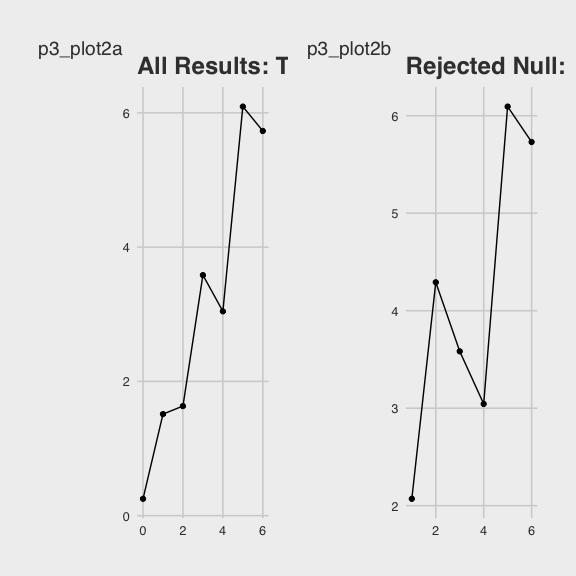

p8105 hw5
================
Alexey Abramov
11/15/2020

  - [Setup](#setup)
  - [Loading the data.](#loading-the-data.)
  - [Problem 1](#problem-1)
      - [Summarizing the data to create two new columns for total
        murders and unsolved
        murders.](#summarizing-the-data-to-create-two-new-columns-for-total-murders-and-unsolved-murders.)
      - [Performing a prop.test for one
        city.](#performing-a-prop.test-for-one-city.)
      - [Now will iterate to the remaining
        cities.](#now-will-iterate-to-the-remaining-cities.)
      - [Plotting results](#plotting-results)
      - [Problem 1 - Describing the
        data](#problem-1---describing-the-data)
  - [Problem 2](#problem-2)
      - [Importing one data set](#importing-one-data-set)
      - [Iterating to importing the remaining
        data…](#iterating-to-importing-the-remaining-data)
      - [Iterating to add the remaining
        data](#iterating-to-add-the-remaining-data)
      - [Data wrangling, and tidying](#data-wrangling-and-tidying)
      - [Problem 2 - Describing the
        Data](#problem-2---describing-the-data)
  - [Problem 3](#problem-3)
      - [Creating the dataset](#creating-the-dataset)
          - [Trying a ‘for loop’ here
            now.](#trying-a-for-loop-here-now.)
      - [Testing the function and simulating 5000
        times](#testing-the-function-and-simulating-5000-times)
      - [Simulating across multiple
        means](#simulating-across-multiple-means)
      - [Creating the reject and fail to reject
        columns.](#creating-the-reject-and-fail-to-reject-columns.)
      - [Plots](#plots)
          - [Plot 1](#plot-1)
          - [Plot 2](#plot-2)
      - [Plot 2A / 2B Discussion](#plot-2a-2b-discussion)

# Setup

``` r
library(tidyverse)
```

    ## ── Attaching packages ───────────────────────────────────────── tidyverse 1.3.0 ──

    ## ✓ ggplot2 3.3.2     ✓ purrr   0.3.4
    ## ✓ tibble  3.0.3     ✓ dplyr   1.0.2
    ## ✓ tidyr   1.1.2     ✓ stringr 1.4.0
    ## ✓ readr   1.3.1     ✓ forcats 0.5.0

    ## ── Conflicts ──────────────────────────────────────────── tidyverse_conflicts() ──
    ## x dplyr::filter() masks stats::filter()
    ## x dplyr::lag()    masks stats::lag()

``` r
library(readr)
library(rvest)
```

    ## Loading required package: xml2

    ## 
    ## Attaching package: 'rvest'

    ## The following object is masked from 'package:purrr':
    ## 
    ##     pluck

    ## The following object is masked from 'package:readr':
    ## 
    ##     guess_encoding

``` r
library(plotly)
```

    ## 
    ## Attaching package: 'plotly'

    ## The following object is masked from 'package:ggplot2':
    ## 
    ##     last_plot

    ## The following object is masked from 'package:stats':
    ## 
    ##     filter

    ## The following object is masked from 'package:graphics':
    ## 
    ##     layout

``` r
library(purrr)
library(stringr)
library(broom)
library(patchwork)


knitr::opts_chunk$set(
  fig.width = 6,
  fig.height = 6,
  out.width = "90%"
)

theme_set(
  ggthemes::theme_fivethirtyeight() + theme(legend.position = "bottom")
  )

options(
  ggplot2.continuous.colour = "viridis",
  ggplot2.continuous.colour = "viridis"
)

scale_colour_discrete = scale_color_viridis_d
scale_fill_discrete = scale_fill_viridis_d
```

# Loading the data.

``` r
homicide_df = 
  read_csv("homicide_data/homicide-data.csv") %>% 
  mutate(
    city_state = str_c(city, state, sep = "_"),
    resolved = case_when(
      disposition == "Closed without arrest" ~ "unsolved",
      disposition == "Open/No arrest"        ~ "unsolved",
      disposition == "Closed by arrest"      ~ "solved",)
  ) %>% 
  select(city_state, resolved) %>% 
  filter(city_state != "Tulsa_AL")
```

    ## Parsed with column specification:
    ## cols(
    ##   uid = col_character(),
    ##   reported_date = col_double(),
    ##   victim_last = col_character(),
    ##   victim_first = col_character(),
    ##   victim_race = col_character(),
    ##   victim_age = col_character(),
    ##   victim_sex = col_character(),
    ##   city = col_character(),
    ##   state = col_character(),
    ##   lat = col_double(),
    ##   lon = col_double(),
    ##   disposition = col_character()
    ## )

# Problem 1

## Summarizing the data to create two new columns for total murders and unsolved murders.

``` r
aggregate_df = 
  homicide_df %>% 
  group_by(city_state) %>% 
  summarize(
    hom_total = n(),
    hom_unsolved = sum(resolved == "unsolved")
  )
```

    ## `summarise()` ungrouping output (override with `.groups` argument)

## Performing a prop.test for one city.

``` r
prop.test(
  aggregate_df %>% filter(city_state == "Baltimore_MD") %>%
    pull(hom_unsolved), 
  aggregate_df %>% filter(city_state == "Baltimore_MD") %>% 
    pull(hom_total)) %>% 
  broom::tidy()
```

    ## # A tibble: 1 x 8
    ##   estimate statistic  p.value parameter conf.low conf.high method    alternative
    ##      <dbl>     <dbl>    <dbl>     <int>    <dbl>     <dbl> <chr>     <chr>      
    ## 1    0.646      239. 6.46e-54         1    0.628     0.663 1-sample… two.sided

## Now will iterate to the remaining cities.

``` r
results_df = 
  aggregate_df %>% 
  mutate(
    prop_tests = map2(.x = hom_unsolved, .y = hom_total, ~prop.test(x = .x, n = .y)),
    tidy_tests = map(.x = prop_tests, ~broom::tidy(.x))
  ) %>% 
  select(-prop_tests) %>% 
  unnest(tidy_tests) %>% 
  select(city_state, estimate, conf.low, conf.high)
```

## Plotting results

``` r
homicide_plot = results_df %>% 
  mutate(city_state = fct_reorder(city_state, estimate)) %>% 
  ggplot(aes(x = city_state, y = estimate)) +
  geom_point() + 
  geom_errorbar(aes(ymin = conf.low, ymax = conf.high)) + 
  theme(axis.text.x = element_text(angle = 90, vjust = 0.5, hjust = 1)) +
  labs(title = "Unsolved Homicides in American Cities")
```

## Problem 1 - Describing the data

These homicide data are obtained from an investigative report published
in the Washington Post on homicides in 50 American cities. The article
focuses on the cities where murders appear to go unsolved. There are a
total of 52178 rows in this dataset. From these data and the
accompanying plot titled “Unsolved Homicides in American Cities” we can
appreciate that the probability of a homicide going unsolved is highest
in Chigago, IL with an estimated 0.73 probability of a murder going
unsolved.

# Problem 2

## Importing one data set

``` r
data_1 = read_csv("lda_data/con_01.csv")
```

    ## Parsed with column specification:
    ## cols(
    ##   week_1 = col_double(),
    ##   week_2 = col_double(),
    ##   week_3 = col_double(),
    ##   week_4 = col_double(),
    ##   week_5 = col_double(),
    ##   week_6 = col_double(),
    ##   week_7 = col_double(),
    ##   week_8 = col_double()
    ## )

## Iterating to importing the remaining data…

``` r
path_df = 
  tibble(
    path = list.files("lda_data")) %>% 
  mutate(
    path = str_c("lda_data/", path))

read_csv(path_df$path[[1]])
```

    ## Parsed with column specification:
    ## cols(
    ##   week_1 = col_double(),
    ##   week_2 = col_double(),
    ##   week_3 = col_double(),
    ##   week_4 = col_double(),
    ##   week_5 = col_double(),
    ##   week_6 = col_double(),
    ##   week_7 = col_double(),
    ##   week_8 = col_double()
    ## )

    ## # A tibble: 1 x 8
    ##   week_1 week_2 week_3 week_4 week_5 week_6 week_7 week_8
    ##    <dbl>  <dbl>  <dbl>  <dbl>  <dbl>  <dbl>  <dbl>  <dbl>
    ## 1    0.2  -1.31   0.66   1.96   0.23   1.09   0.05   1.94

## Iterating to add the remaining data

``` r
path_df = 
  tibble(
    path = list.files("lda_data")) %>% 
  mutate(
    path = str_c("lda_data/", path),
    data = map(path_df$path, read_csv))
```

    ## Parsed with column specification:
    ## cols(
    ##   week_1 = col_double(),
    ##   week_2 = col_double(),
    ##   week_3 = col_double(),
    ##   week_4 = col_double(),
    ##   week_5 = col_double(),
    ##   week_6 = col_double(),
    ##   week_7 = col_double(),
    ##   week_8 = col_double()
    ## )
    ## Parsed with column specification:
    ## cols(
    ##   week_1 = col_double(),
    ##   week_2 = col_double(),
    ##   week_3 = col_double(),
    ##   week_4 = col_double(),
    ##   week_5 = col_double(),
    ##   week_6 = col_double(),
    ##   week_7 = col_double(),
    ##   week_8 = col_double()
    ## )
    ## Parsed with column specification:
    ## cols(
    ##   week_1 = col_double(),
    ##   week_2 = col_double(),
    ##   week_3 = col_double(),
    ##   week_4 = col_double(),
    ##   week_5 = col_double(),
    ##   week_6 = col_double(),
    ##   week_7 = col_double(),
    ##   week_8 = col_double()
    ## )
    ## Parsed with column specification:
    ## cols(
    ##   week_1 = col_double(),
    ##   week_2 = col_double(),
    ##   week_3 = col_double(),
    ##   week_4 = col_double(),
    ##   week_5 = col_double(),
    ##   week_6 = col_double(),
    ##   week_7 = col_double(),
    ##   week_8 = col_double()
    ## )
    ## Parsed with column specification:
    ## cols(
    ##   week_1 = col_double(),
    ##   week_2 = col_double(),
    ##   week_3 = col_double(),
    ##   week_4 = col_double(),
    ##   week_5 = col_double(),
    ##   week_6 = col_double(),
    ##   week_7 = col_double(),
    ##   week_8 = col_double()
    ## )
    ## Parsed with column specification:
    ## cols(
    ##   week_1 = col_double(),
    ##   week_2 = col_double(),
    ##   week_3 = col_double(),
    ##   week_4 = col_double(),
    ##   week_5 = col_double(),
    ##   week_6 = col_double(),
    ##   week_7 = col_double(),
    ##   week_8 = col_double()
    ## )
    ## Parsed with column specification:
    ## cols(
    ##   week_1 = col_double(),
    ##   week_2 = col_double(),
    ##   week_3 = col_double(),
    ##   week_4 = col_double(),
    ##   week_5 = col_double(),
    ##   week_6 = col_double(),
    ##   week_7 = col_double(),
    ##   week_8 = col_double()
    ## )
    ## Parsed with column specification:
    ## cols(
    ##   week_1 = col_double(),
    ##   week_2 = col_double(),
    ##   week_3 = col_double(),
    ##   week_4 = col_double(),
    ##   week_5 = col_double(),
    ##   week_6 = col_double(),
    ##   week_7 = col_double(),
    ##   week_8 = col_double()
    ## )
    ## Parsed with column specification:
    ## cols(
    ##   week_1 = col_double(),
    ##   week_2 = col_double(),
    ##   week_3 = col_double(),
    ##   week_4 = col_double(),
    ##   week_5 = col_double(),
    ##   week_6 = col_double(),
    ##   week_7 = col_double(),
    ##   week_8 = col_double()
    ## )
    ## Parsed with column specification:
    ## cols(
    ##   week_1 = col_double(),
    ##   week_2 = col_double(),
    ##   week_3 = col_double(),
    ##   week_4 = col_double(),
    ##   week_5 = col_double(),
    ##   week_6 = col_double(),
    ##   week_7 = col_double(),
    ##   week_8 = col_double()
    ## )
    ## Parsed with column specification:
    ## cols(
    ##   week_1 = col_double(),
    ##   week_2 = col_double(),
    ##   week_3 = col_double(),
    ##   week_4 = col_double(),
    ##   week_5 = col_double(),
    ##   week_6 = col_double(),
    ##   week_7 = col_double(),
    ##   week_8 = col_double()
    ## )
    ## Parsed with column specification:
    ## cols(
    ##   week_1 = col_double(),
    ##   week_2 = col_double(),
    ##   week_3 = col_double(),
    ##   week_4 = col_double(),
    ##   week_5 = col_double(),
    ##   week_6 = col_double(),
    ##   week_7 = col_double(),
    ##   week_8 = col_double()
    ## )
    ## Parsed with column specification:
    ## cols(
    ##   week_1 = col_double(),
    ##   week_2 = col_double(),
    ##   week_3 = col_double(),
    ##   week_4 = col_double(),
    ##   week_5 = col_double(),
    ##   week_6 = col_double(),
    ##   week_7 = col_double(),
    ##   week_8 = col_double()
    ## )
    ## Parsed with column specification:
    ## cols(
    ##   week_1 = col_double(),
    ##   week_2 = col_double(),
    ##   week_3 = col_double(),
    ##   week_4 = col_double(),
    ##   week_5 = col_double(),
    ##   week_6 = col_double(),
    ##   week_7 = col_double(),
    ##   week_8 = col_double()
    ## )
    ## Parsed with column specification:
    ## cols(
    ##   week_1 = col_double(),
    ##   week_2 = col_double(),
    ##   week_3 = col_double(),
    ##   week_4 = col_double(),
    ##   week_5 = col_double(),
    ##   week_6 = col_double(),
    ##   week_7 = col_double(),
    ##   week_8 = col_double()
    ## )
    ## Parsed with column specification:
    ## cols(
    ##   week_1 = col_double(),
    ##   week_2 = col_double(),
    ##   week_3 = col_double(),
    ##   week_4 = col_double(),
    ##   week_5 = col_double(),
    ##   week_6 = col_double(),
    ##   week_7 = col_double(),
    ##   week_8 = col_double()
    ## )
    ## Parsed with column specification:
    ## cols(
    ##   week_1 = col_double(),
    ##   week_2 = col_double(),
    ##   week_3 = col_double(),
    ##   week_4 = col_double(),
    ##   week_5 = col_double(),
    ##   week_6 = col_double(),
    ##   week_7 = col_double(),
    ##   week_8 = col_double()
    ## )
    ## Parsed with column specification:
    ## cols(
    ##   week_1 = col_double(),
    ##   week_2 = col_double(),
    ##   week_3 = col_double(),
    ##   week_4 = col_double(),
    ##   week_5 = col_double(),
    ##   week_6 = col_double(),
    ##   week_7 = col_double(),
    ##   week_8 = col_double()
    ## )
    ## Parsed with column specification:
    ## cols(
    ##   week_1 = col_double(),
    ##   week_2 = col_double(),
    ##   week_3 = col_double(),
    ##   week_4 = col_double(),
    ##   week_5 = col_double(),
    ##   week_6 = col_double(),
    ##   week_7 = col_double(),
    ##   week_8 = col_double()
    ## )
    ## Parsed with column specification:
    ## cols(
    ##   week_1 = col_double(),
    ##   week_2 = col_double(),
    ##   week_3 = col_double(),
    ##   week_4 = col_double(),
    ##   week_5 = col_double(),
    ##   week_6 = col_double(),
    ##   week_7 = col_double(),
    ##   week_8 = col_double()
    ## )

Checking now to see if this works…

``` r
path_df$data[[1]]
```

    ## # A tibble: 1 x 8
    ##   week_1 week_2 week_3 week_4 week_5 week_6 week_7 week_8
    ##    <dbl>  <dbl>  <dbl>  <dbl>  <dbl>  <dbl>  <dbl>  <dbl>
    ## 1    0.2  -1.31   0.66   1.96   0.23   1.09   0.05   1.94

Nice, ok yes it does\!

## Data wrangling, and tidying

This involves separating a few variables and selecting columns and then
unnesting. Tried to delete with str\_sub but kept getting a strange
error.

``` r
path_df =
  path_df %>% 
  separate(path, into = c("lda_data", "study_arm"), sep = "/") %>% 
  separate(study_arm, into = c("study_arm", "samp"), sep = "_") %>% 
  separate(samp, into = c("subject", "csv", sep = ".")) %>% 
  select(!c(lda_data, csv, .)) %>% 
  mutate(
    subject = as.numeric(subject),
    study_arm = as.factor(study_arm)) %>% 
  group_by(study_arm) %>% 
  unnest(data)
```

    ## Warning: Expected 3 pieces. Missing pieces filled with `NA` in 20 rows [1, 2, 3,
    ## 4, 5, 6, 7, 8, 9, 10, 11, 12, 13, 14, 15, 16, 17, 18, 19, 20].

Now to create the spaghetti plot, I think we’ll have to pivot longer.

``` r
path_df =
  path_df %>% 
  pivot_longer(week_1:week_8, 
      names_to = "week", 
      values_to = "observation",
      names_prefix = "week_") %>% 
  mutate(
    week = as.numeric(week))
```

And now graph it.

``` r
path_plot = 
  path_df %>% 
  ggplot(aes(x = week, y = observation, group = subject)) +
    geom_line() + 
    facet_grid(. ~ study_arm) +  
    stat_smooth(aes(group = 1), method = "lm", se = TRUE) +
  labs(
    title = "Observations Over Time")
```

## Problem 2 - Describing the Data

This dataset from 20 subjects from two groups, control and experimental,
and taken across 8 week timepoints reflects numeric the researcher’s
observations. From these data, we can appreciate that over the course of
8 weeks, the observations in the experimental arm increased while those
in the control arm decreased slightly.

# Problem 3

## Creating the dataset

``` r
sim_ttest = function(n, mu = 0, sigma = 5) {
 
  sim_data = tibble(
    x = rnorm(n = 30, mean = mu, sd = sigma),
  )
 
    ttest= t.test(sim_data, mu=0, sd=5)
    ttest[['p.value']]
    ttest[['estimate']]
   
  sim_results = tibble(
     pvalue = ttest[['p.value']],
     estimate = ttest[['estimate']],
     true_mu = mu
  )
}
```

### Trying a ‘for loop’ here now.

``` r
output = vector("list", 5000)

for (i in 1:5000) {
  output[[i]] = sim_ttest(30)
}
sim_results = bind_rows(output)
```

## Testing the function and simulating 5000 times

``` r
sim_results_test =
  rerun(5000, sim_ttest(30, 0, 5)) %>%
  bind_rows()
```

## Simulating across multiple means

``` r
mu_list =
  list(
    "m_0" = 0,
    "m_1" = 1,
    "m_2" = 2,
    "m_3" = 3,
    "m_4" = 4,
    "m_5" = 5,
    "m_6" = 6)

mu_output = vector("list", length = 7)

for (i in 1:7) {
  mu_output[[i]] = rerun(5, sim_ttest(30, mu_list[[i]], 5))
}
```

## Creating the reject and fail to reject columns.

``` r
p3_plot1_df =
  bind_rows(mu_output) %>% 
  group_by(true_mu) %>% 
  mutate(
    test_outcome = 
      case_when(
        pvalue < .05 ~ "reject",
        pvalue >= .05 ~ "fail"),
    test_outcome = as.factor(test_outcome)) %>% 
  summarize(
    test_total = n(),
    test_rejected = sum(test_outcome == "reject")) %>% 
  mutate(
    power = test_rejected / test_total)
```

    ## `summarise()` ungrouping output (override with `.groups` argument)

## Plots

### Plot 1

``` r
p3_plot1 = p3_plot1_df %>% 
  ggplot(aes(x = true_mu, y = power)) + 
  geom_point() + 
  geom_line() + 
  labs(
    title = "The Power of Mu",
    tag = "p3_plot1"
  )

p3_plot1
```


#### Plot 1 Discussion

This plot demonstrates in a provided sample with standard deviation, the
greater the difference between the means of the null and alternative
distributions, the greater the power.

### Plot 2

Building back the initial data set to return to the estimate and true
mu.

``` r
p3_plot2_df =
  bind_rows(mu_output) %>% 
  group_by(true_mu) %>% 
  mutate(
    test_outcome = 
      case_when(
        pvalue < .05 ~ "reject",
        pvalue >= .05 ~ "fail"),
    test_outcome = as.factor(test_outcome))
```

Thinking about how to get the mean estimate in each true mu. Pivot
wider? Helps to see it but I don’t think this will work.

``` r
p3_wide_df = p3_plot2_df %>% 
  pivot_wider(
    names_from = true_mu,
    values_from = estimate,
    names_prefix = "var")
```

Group\_by and then summarize will probably work better here.

``` r
p3_plot2a_df = p3_plot2_df %>% 
  group_by(true_mu) %>% 
  summarize(
    mean_estimate = mean(estimate)
  )
```

    ## `summarise()` ungrouping output (override with `.groups` argument)

#### Plot 2A

``` r
p3_plot2a = 
  p3_plot2a_df %>% 
  ggplot(aes(x = true_mu, y = mean_estimate)) + 
  geom_point() + 
  geom_line() +
  labs(
    title = "All Results: True Mu to Estimate Mu",
    tag = "p3_plot2a"
  )

p3_plot2a
```


#### Plot 2B

``` r
p3_plot2b_df =
  p3_plot2_df %>% 
  filter(
    test_outcome == "reject") %>% 
  group_by(true_mu) %>% 
  summarize(
    mean_estimate = mean(estimate))
```

    ## `summarise()` ungrouping output (override with `.groups` argument)

``` r
p3_plot2b = 
  p3_plot2b_df %>% 
  ggplot(aes(x = true_mu, y = mean_estimate)) + 
  geom_point() + 
  geom_line() +
  labs(
    title = "Rejected Null:  True Mu to Estimate Mu",
    tag = "p3_plot2b"
  )

p3_plot2b
```


``` r
p3_plot2a + p3_plot2b
```



## Plot 2A / 2B Discussion

The sample average of μ̂ across tests for which the nullis rejected is
not approximately equal to the true mu. This makes sense because if the
mean of the estimates of mu were approximately equal to the true mu, you
would fail to reject the null hypothesis.
